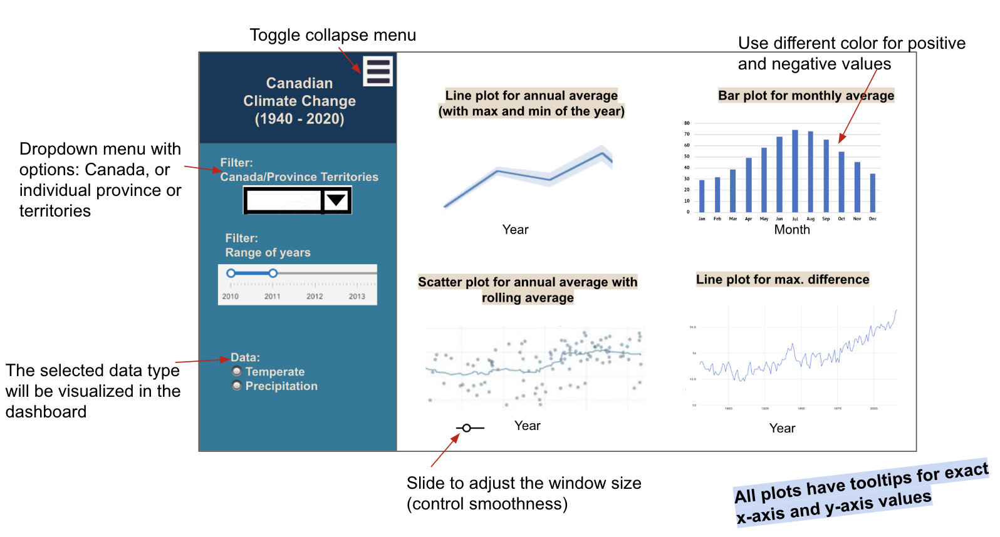

# Climadash
***Exploring Climate Change in Canada: A Shiny App to Raise Awareness and Encourage Reflection***
===

## Welcome!

This document serves as a central source of information for our project. To quickly access specific details, navigate to one of the sections below. Alternatively, feel free to scroll through the entire document to learn more about our project.

[Welcome!](#welcome)

[What are we doing?](#what-are-we-doing)

[Who are we?](#who-are-we)

[Get Involved: Ways to Help Promote Climate Action through Our App](#get-involved-ways-to-help-promote-climate-action-through-our-app)

[Description](#description)

[License](#license)

## What are we doing?
Our Shiny app aims to raise awareness and promote reflection on the issue of climate change in Canada. Through interactive data visualizations and educational resources, we hope to inspire people to think more deeply about the impact of climate change on our planet and the urgent need to take action to address this global challenge. Our goal is to empower individuals to make informed decisions and take meaningful steps towards a more sustainable future.

## Who are we?
We are a team of data science students at the University of British Columbia who are passionate about using our skills to make a positive impact on the world. As part of our coursework, we have chosen to focus on the crucial issue of climate change and develop a Shiny app that raises awareness and encourages action on this pressing global challenge. We believe that data-driven insights and visualization can be powerful tools for promoting understanding and driving change, and we are committed to using our project to make a difference.
We believe that our Shiny app is just the first step towards promoting greater awareness and action on climate change in Canada. While our app provides a glimpse into some of the key data and issues related to climate change, there is much more to explore and discover. We encourage you to continue your own learning and exploration of this critical topic, whether through additional research, conversations with experts, or involvement in local and global initiatives. Together, we can all contribute to building a more sustainable and resilient future for ourselves and future generations.

### Collaborators
Vikram Grewal, Kelly Wu, Xinru Lu, Mehdi Naji

## Get Involved: Ways to Help Promote Climate Action through Our App

- **Spread the word:** 
  Share our Shiny app with your friends, family, and social networks. The more people who see and use our app, the more impact we can have in raising awareness about climate change in Canada.

- **Provide feedback:** 
  We value your input and would love to hear your thoughts on our app. If you have any feedback, suggestions, or comments, please don't hesitate to reach out to us. Your feedback can help us improve our app and make it even more effective in promoting climate action.

- **Contribute data:** 
  If you have access to data related to climate change in Canada that you think would be valuable for our app, we would love to hear from you. We are always looking to expand and improve the data visualizations in our app to provide a more comprehensive view of the issue.

- **Take action:** 
  Our app is designed to inspire action and encourage individuals to take meaningful steps towards a more sustainable future. Consider making changes in your own life to reduce your carbon footprint and contribute to the fight against climate change.

## Description

This dashboard aim to show the Canadian climate change over eighty years. The dashboard contains a landing page that shows visualization of several key metrics for Canadian weather data from 1940 - 2020. 

To show the general trend over years, two plots are presented: the line plot with **three** lines (for annual average, maximum and minimum) and a scatter plot of annual average with rolling average, with a slider that allows users to adjust the window size of the rolling average and the smoothness of trendline. These two plots are alined vertically to allow easier comparison. Color coding will be used to distinguish the three lines.

To show the temperature distribution by month, a bar plot for monthly averages over years is presented. Color coding will be used to distinguish negative and positive values.

To tell the story about extreme weathers, a line plot for the annual maximum temperature difference is presented. 

In the menu, the user can use three widgets to customize the information displayed in the dashboard. From the dropdown, users can select to see the data for entire Canada or only certain province or territory. From the year filter, users can zoom in and out to examine the trend during specific range of years. From the radio buttons, users can choose to view the data for temperature, or precipitation. 

Tooltip will be used in all plots so that users can easily check the actual x-axis and y-axis values when hovering over the plots.

Here is a sketch of the dashboard.

## License

`climadash` was created by Vikram Grewal, Kelly Wu, Xinru Lu and Mehdi Naji. 
It is licensed under the terms of the MIT license.

